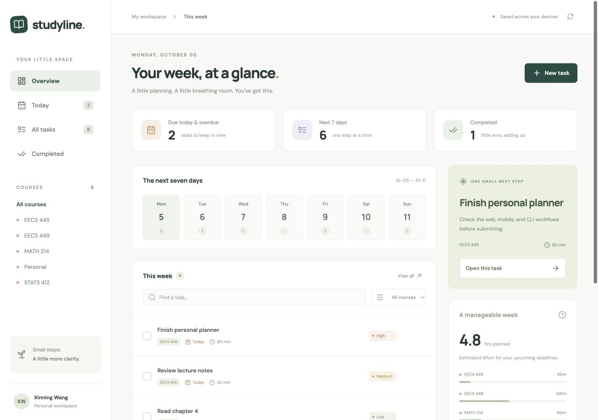

# Studyline

**Name:** Xinning Wang

**UMID:** kokowang

A small personal planner for keeping coursework out of my head and in one place. I can plan deadlines at my desk, check off work on my phone, and capture a task from the terminal. All four components are written in Jac and use the same persistent task graph.



[View the mobile screenshot](docs/mobile.jpg)

## Features

- Tasks with a course or area, deadline, priority, estimated minutes, and optional notes.
- Today (including overdue work), next seven days, all open tasks, and completed tasks.
- A clickable week strip, course filters, search, and estimated workload on the web.
- Add, edit, complete, reopen, and delete tasks on the web; quickly add and complete tasks on mobile.
- Terminal commands for adding tasks, reading plans, completing/reopening tasks, and deletion; JSON output for scripting.
- Explicit sample-week button for trying the app. It works only in an empty planner.

Dates follow the server computer's local calendar. Undated tasks appear in **All tasks**; Today and the week view include only tasks with deadlines. Estimates are a guide, not scheduled time blocks. The web refreshes shared data every 15 seconds; mobile has a Refresh button.

## Setup and run

Install **Jac 0.37.23** using the official installer. On macOS or Linux:

```bash
curl -fsSL https://raw.githubusercontent.com/jaseci-labs/jac/main/scripts/install.sh -o /tmp/install-jac.sh
bash /tmp/install-jac.sh --version 0.37.23
export PATH="$HOME/.local/bin:$PATH"
jac --version
```

On Windows, use WSL. The Jac binary includes its runtime and JavaScript tooling: no separate Node.js, Python environment, database installation, AI account, or API key is required to run the planner. Internet access is needed for the first dependency installation and Jac's managed database provisioning. VS Code's Jac extension is useful for editing but not required to run the app.

From this repository's root:

```bash
jac install --npm
jac run
```

Open **http://localhost:8000**. `jac.toml` selects the web app by default, and `jac run` starts its server, the shared planner service, and the frontend together. Leave that terminal running. The first start may take longer while Jac prepares its database and frontend.

Start with **New task**, or choose **Explore sample week** in an empty planner. Click a task title to edit it; the checkbox completes it. The Completed view lets you reopen it. Refresh reloads changes made from another interface.

Jac persists task nodes attached to `root` in its managed PostgreSQL store. Stopping and restarting the server preserves tasks. The database is local and associated with the checkout's absolute path; a fresh checkout gets a fresh planner. `jac db status` shows database status. Do not delete Jac's database/cache if you want to retain your tasks.

This is a local, single-person planner. Its public planning endpoints intentionally share one workspace without login. The backend binds to loopback by default.

## CLI

Keep `jac run` running in the first terminal. In a second terminal, from the same repository root:

```bash
jac run cli add "Finish planner project" --course "EECS 449" --due 2026-10-10 --priority high --minutes 60
jac run cli today
jac run cli week
jac run cli list
jac run cli completed
jac run cli --json list
```

Each task displays an ID. Substitute that ID below; a unique prefix also works:

```bash
jac run cli done TASK_ID
jac run cli reopen TASK_ID
jac run cli delete TASK_ID
jac run cli delete TASK_ID --yes
jac run cli demo
```

Omit `--due` for an undated task. Optional `--notes "Start with the outline"` adds a reminder. Run `jac run cli --help` for all commands. Deletion asks for confirmation unless `--yes` is supplied. Invalid data and connection failures return a nonzero exit status.

For a server on another port, put global options before the command:

```bash
jac run cli --server http://127.0.0.1:9000 today
```

Alternatively, set `STUDYLINE_URL`. The CLI calls the running Jac service; it does not open its own task store.

## Mobile

The mobile app is a separate **native mobUI app**, using `View`, `Text`, `TextInput`, `Pressable`, and `ScrollView`. It is authored in Jac and compiled through Jac's Expo/React Native support. The browser preview uses React Native Web; it is useful for trying the screens without a mobile toolchain.

### Browser preview

Keep the web server running. Build the mobile browser bundle, then start its small Jac preview server in a second terminal. Its backend is the existing planner at `http://localhost:8000`, configured under `[apps.mobile.client.api]` in `jac.toml`.

```bash
jac build mobile --platform web
jac run --no-takeover scripts/mobile_preview.jac
```

Open **http://localhost:8002**. The preview server serves only the compiled mobile assets; planning calls still go to the existing Jac backend at port 8000. Use Today, All tasks, or Done; tap the checkbox to complete/reopen a task. Tap New task to add one, and Refresh to pick up changes made from the other clients.

### Android or iOS

```bash
jac setup mobile
jac run --no-takeover scripts/configure_mobile.jac
jac run --platform android mobile
# macOS + Xcode, with an iOS simulator available:
jac run --platform ios mobile
```

Jac provisions the Expo scaffold and Android tools. The configuration helper sets the native app name, app IDs, and Expo API URL from `jac.toml`; Jac 0.37.23's native build reads the backend URL from Expo metadata. Android requires accepting the SDK license and a connected device or emulator. iOS requires macOS, Xcode, its command-line tools, and an installed simulator runtime. Native builds use:

```bash
jac build mobile --platform android
jac build mobile --platform ios
```

A phone's `localhost` is the phone itself. For a physical device, set `[apps.mobile.client.api] base_url` to your computer's LAN URL, for example `http://192.168.1.20:8000`, then run the backend with `jac run --host 0.0.0.0` on a trusted local network. Rerun `scripts/configure_mobile.jac` with the command above, then rebuild/relaunch mobile after changing the URL. An Android emulator usually reaches the host at `http://10.0.2.2:8000`; the iOS simulator can use `http://localhost:8000`. The native app requires the running backend and network connectivity.

## How the pieces fit together

`jac.toml` defines four apps:

- **Server:** `core/planner.jac`, the `planner` service. It owns persistent Task nodes, input validation, sorting, and mutations. Plain TaskData objects carry task information across app boundaries.
- **Web:** `web/main.jac`, a Jac/React interface that calls the service through Jac-generated HTTP functions.
- **Mobile:** `mobile/main.jac`, a native mobUI interface calling the same service.
- **CLI:** `cli/main.jac`, a Jac terminal program using Jac's server-to-server service bridge.

A default `jac run` colocates the planner service with the web server. Both clients and the CLI reach `/api/planner/function/...`; no separate task databases or duplicated planning rules are involved. The API is visible in Jac's generated documentation at **http://localhost:8000/docs**.

What makes this project useful is its coherence: one small set of planning actions works across three interfaces, survives restarts, validates input centrally, and keeps completion reversible. The web shows deadline and effort context, while mobile and CLI keep the everyday actions quick. There is no AI subscription or unrelated feature set to configure.

## Verification

Type-check each component:

```bash
jac check -n --app web web/main.jac core/planner.jac
jac check -n --app mobile mobile/main.jac
jac check -n --app cli cli/main.jac
```

With `jac run` running, the optional integration check uses Python 3's standard library (no pip dependencies):

```bash
python3 tests/smoke.py
```

It checks validation, CLI creation, API edits visible in the CLI, Today/completed filtering, repeat completion, reopening, deletion, and protection of existing tasks. It removes only its own temporary task.

Before submitting from a fresh checkout: install dependencies, start `jac run`, add a task from the CLI, confirm it appears on the web and mobile, complete it on mobile, then stop/restart the server and confirm the completed state remains. See `VERIFICATION.md` for checks performed during development.

## Learning references

The workspace structure and service bridge follow the [official complete example](https://github.com/jaseci-labs/jac/tree/v0.37.23/jac/examples/jaclang_org), scaffolded with `jac create --awesome`. The task graph and public API patterns build on the [Jac day-planner guide](https://jaclang.org/docs/v0.37/tutorials/first-app/build-ai-day-planner). Mobile follows Jac's [desktop/mobile documentation](https://jaclang.org/docs/latest/build/desktop-mobile). The planning workflow and UI are specific to Studyline.
